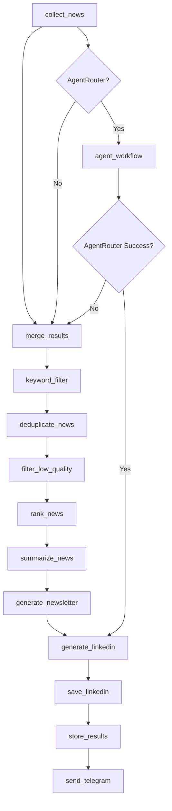

# Architecture

## Optimized Flow



## Key Optimizations

1. **Keyword Filtering** - Local Python filtering BEFORE LLM calls (46% articles filtered)
2. **Batch Summarization** - 10 articles per LLM call (90% fewer API calls)
3. **Token Optimization** - Only title + summary sent to LLM
4. **Provider Fallback** - Groq → OpenRouter (5 fallback models) → template
5. **Caching** - SQLite-based summary cache (7-day TTL)
6. **Rate Limiting** - Exponential backoff (2s → 8s), max 2 concurrent requests

## Components

### Collectors (`app/collectors/`)
- `rss.py` - RSS feed collection (15+ sources)
- `hackernews.py` - Hacker News API
- `arxiv.py` - ArXiv papers
- `github.py` - GitHub Trending
- `devto.py` - DEV.to articles
- `producthunt.py` - Product Hunt
- `keyword_filter.py` - Local AI keyword filtering

### Ranking (`app/ranking/`)
- `deduplication.py` - ChromaDB semantic deduplication
- `scorer.py` - Importance scoring
- `embeddings.py` - HuggingFace embeddings

### LLM (`app/llm/`)
- `router.py` - Multi-provider routing with fallback
- `providers.py` - Groq, OpenRouter, Gemini implementations
- `batch_summarizer.py` - Batch processing with semaphore

### Newsletter (`app/newsletter/`)
- `generator.py` - Telegram newsletter generation
- `linkedin_generator.py` - LinkedIn long-form newsletter
- `formatter.py` - Output formatting

### Graph (`app/graph/`)
- `workflow.py` - LangGraph StateGraph
- `state.py` - Typed state schema
- `nodes/` - Individual workflow nodes

### Integrations
- `telegram/bot.py` - Telegram delivery
- `google_drive.py` - LinkedIn newsletter storage

## Provider Chain

```
Summarization:
  Groq (llama-3.3-70b-versatile) → OpenRouter (5 fallback models) → deterministic

Newsletter:
  Gemini (gemini-2.5-flash) → OpenRouter → template fallback
```

## Data Flow

1. **Collection** - Gather from RSS, HN, ArXiv, GitHub, DEV.to
2. **Merge** - Combine all sources
3. **Keyword Filter** - Remove non-AI content (local, no LLM)
4. **Deduplicate** - ChromaDB semantic dedup
5. **Filter** - Quality filtering
6. **Rank** - Importance scoring
7. **Summarize** - Batch LLM summarization
8. **Generate** - Create Telegram + LinkedIn newsletters
9. **Store** - Persist to SQLite
10. **Send** - Deliver to Telegram

## Environment

- **Orchestration**: LangGraph 0.2+
- **LLM Providers**: Groq, OpenRouter, Gemini
- **Vector Store**: ChromaDB
- **Database**: SQLite (newsletter.db, summary_cache.db)
- **API Server**: FastAPI
- **Scheduler**: APScheduler