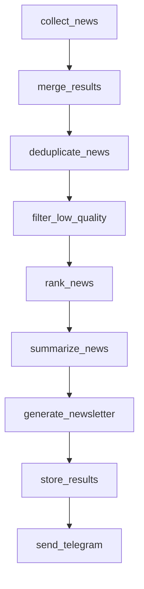

# Architecture

## Flow

## Components

- Collectors: source adapters
- Ranking: deduplication + scoring
- Summarization: LLM output shaping
- Newsletter: final rendering
- Delivery: Telegram transport
