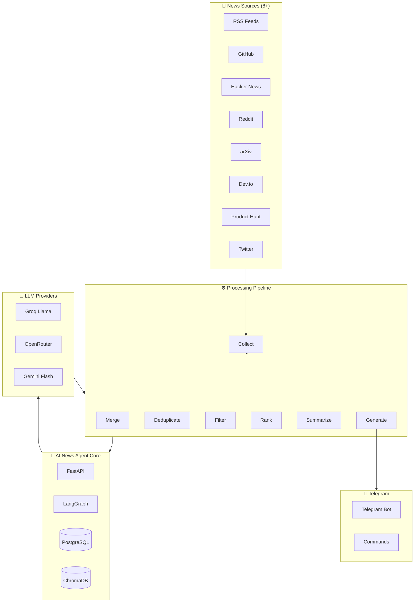
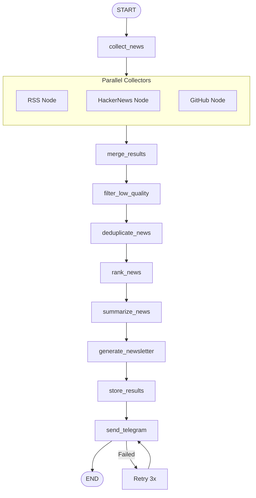

# 🧠 AI Intelligence Newsletter Agent

<p align="center">

[](https://www.python.org/)
[](LICENSE)
[](https://langchain-ai.github.io/langgraph/)
[](https://www.docker.com/)
[](https://render.com)

</p>

> **Autonomous AI news collection, ranking, summarization, and Telegram delivery powered by LangGraph.**

An open-source AI agent system that automatically collects AI news from multiple sources, filters high-signal information, ranks developments by importance, generates professional newsletters, and delivers them via Telegram — all running on free-tier infrastructure.

---

## ✨ Features

| Feature | Description |
|---------|-------------|
| **Multi-Source Collection** | Collects from 8+ sources: RSS feeds, GitHub Trending, Hacker News, Reddit, arXiv, Dev.to, Product Hunt, Twitter |
| **Semantic Deduplication** | Uses ChromaDB + HuggingFace embeddings to remove duplicate content |
| **Smart Ranking** | Scores news by virality, technical importance, and community attention |
| **LLM Summarization** | Generates concise, readable summaries using Groq (free tier) |
| **Professional Newsletter** | Creates formatted daily briefs with categorized sections |
| **Telegram Delivery** | Sends to users via Telegram Bot with command handlers |
| **LangGraph Orchestration** | DAG-based workflow with parallel execution and checkpointing |
| **Production-Ready** | Docker support, error handling, retry logic, logging |
| **Free Tier Compatible** | Runs entirely on free services: Groq, HuggingFace, Render |

---

## 🏗️ Architecture Overview



### Tech Stack

| Component | Technology | Purpose |
|-----------|------------|---------|
| **Orchestration** | LangGraph | Workflow management, DAG execution |
| **LLM Primary** | Groq Llama-3.3 | Fast, free summarization |
| **LLM Fallback** | OpenRouter DeepSeek | Rate limit handling |
| **LLM Formatting** | Gemini Flash | Final newsletter polish |
| **Embeddings** | HuggingFace Sentence Transformers | Semantic similarity |
| **Vector Store** | ChromaDB | Deduplication & semantic search |
| **Database** | PostgreSQL | Persistent storage |
| **API Server** | FastAPI | REST endpoints |
| **Messaging** | Telegram Bot API | User delivery |
| **Scheduler** | APScheduler | 24-hour cycles |
| **Observability** | LangSmith | Tracing & debugging |
| **Deployment** | Docker + Render | Cloud hosting |

---

## 🚀 Quick Start

### Prerequisites

- Python 3.11+
- Telegram account
- Groq API key (free)

### Installation

```bash
# Clone the repository
git clone https://github.com/yourusername/ai-news-agent.git
cd ai-news-agent

# Create virtual environment
python -m venv .venv

# Activate (Windows)
.venv\Scripts\Activate.ps1

# Activate (macOS/Linux)
source .venv/bin/activate

# Install dependencies
pip install -r requirements.txt
```

### Configuration

```bash
# Copy environment template
cp .env.example .env

# Edit with your API keys
# Required: GROQ_API_KEY, TELEGRAM_BOT_TOKEN, TELEGRAM_CHAT_ID
```

### Run Modes

```bash
# One-shot newsletter generation
python main.py --mode workflow

# 24-hour scheduler (local/server)
python main.py --mode scheduler

# Telegram bot polling
python main.py --mode bot

# Docker deployment
docker-compose up -d
```

---

## 📋 API Keys Setup

| Service | Environment Variable | How to Get |
|---------|---------------------|------------|
| **Groq** | `GROQ_API_KEY` | [console.groq.com](https://console.groq.com) |
| **Telegram Bot** | `TELEGRAM_BOT_TOKEN` | @BotFather on Telegram |
| **Telegram Chat** | `TELEGRAM_CHAT_ID` | @userinfobot on Telegram |
| **LangSmith** (optional) | `LANGCHAIN_API_KEY` | [smith.langchain.com](https://smith.langchain.com) |

---

## 📁 Project Structure

```
ai-news-agent/
├── app/
│   ├── collectors/          # News source collectors
│   │   ├── rss.py          # RSS feed parser
│   │   ├── github.py       # GitHub Trending
│   │   ├── hackernews.py   # Hacker News API
│   │   ├── reddit.py      # Reddit API
│   │   └── twitter.py     # Twitter/X (future)
│   │
│   ├── graph/              # LangGraph workflow
│   │   ├── workflow.py    # Main workflow definition
│   │   ├── state.py       # Typed state schema
│   │   ├── builder.py     # Graph builder
│   │   └── nodes/         # Individual nodes
│   │
│   ├── ranking/            # News ranking
│   │   ├── scorer.py      # Scoring logic
│   │   ├── deduplication.py  # Semantic dedupe
│   │   └── embeddings.py  # Embedding generation
│   │
│   ├── summarization/      # LLM summarization
│   │   ├── summarizer.py  # Summarization logic
│   │   └── prompts.py    # LLM prompts
│   │
│   ├── newsletter/         # Newsletter generation
│   │   ├── generator.py   # Newsletter builder
│   │   └── formatter.py   # Message formatting
│   │
│   ├── telegram/           # Telegram integration
│   │   ├── bot.py         # Bot setup
│   │   └── handlers.py    # Command handlers
│   │
│   ├── database/           # Data persistence
│   │   ├── postgres.py    # PostgreSQL connection
│   │   └── models.py      # Data models
│   │
│   ├── memory/             # Memory & checkpointing
│   │   ├── checkpoint.py  # LangGraph checkpointer
│   │   └── vectorstore.py # ChromaDB wrapper
│   │
│   ├── observability/      # Monitoring
│   │   └── langsmith.py   # LangSmith tracing
│   │
│   ├── scheduler/          # Job scheduling
│   │   └── jobs.py        # APScheduler jobs
│   │
│   └── config/             # Configuration
│       └── settings.py    # Pydantic settings
│
├── tests/                  # Test suite
├── docker/                # Docker files
├── docs/                  # Documentation
├── main.py               # Entry point
├── requirements.txt      # Dependencies
└── .env.example         # Environment template
```

---

## 📊 LangGraph Workflow



---

## 🤖 Telegram Commands

| Command | Description |
|---------|-------------|
| `/start` | Welcome message & subscription |
| `/daily` | Send today's newsletter |
| `/trending` | Top 5 trending AI news |
| `/opensource` | Open source AI projects |
| `/research` | Latest AI research papers |
| `/subscribe` | Subscribe to daily updates |
| `/unsubscribe` | Unsubscribe from updates |
| `/help` | Show all commands |

---

## 🌍 Deployment

### Docker (Local/Server)

```bash
# Build and run
docker-compose up -d

# View logs
docker-compose logs -f
```

### Render (Free Tier)

1. Push to GitHub
2. Create [Render](https://render.com) account
3. Create Web Service + Cron Job
4. Set environment variables
5. Deploy!

See [DEPLOYMENT.md](DEPLOYMENT.md) for detailed instructions.

---

## 🧪 Testing

```bash
# Run all tests
pytest tests/ -v

# Run with coverage
pytest tests/ --cov=app --cov-report=html

# Run specific test
pytest tests/test_workflow.py -v

# Validate production setup
python validate_production.py
```

---

## 📚 Documentation

| Document | Description |
|----------|-------------|
| [ARCHITECTURE.md](docs/ARCHITECTURE.md) | System design & diagrams |
| [DEPLOYMENT.md](docs/DEPLOYMENT.md) | Deployment guides |
| [API_REFERENCE.md](docs/API_REFERENCE.md) | API documentation |
| [CONTRIBUTING.md](CONTRIBUTING.md) | Contribution guidelines |
| [CODE_OF_CONDUCT.md](CODE_OF_CONDUCT.md) | Community code of conduct |
| [SECURITY.md](SECURITY.md) | Security policy |
| [ROADMAP.md](ROADMAP.md) | Project roadmap |
| [CHANGELOG.md](CHANGELOG.md) | Version history |
| [TROUBLESHOOTING.md](TROUBLESHOOTING.md) | Common issues & solutions |
| [FAQ.md](FAQ.md) | Frequently asked questions |

---

## 🎯 Roadmap

### Phase 1 ✅ (Completed)
- [x] RSS collection
- [x] Basic summarization
- [x] Telegram delivery

### Phase 2 ✅ (Completed)
- [x] Reddit integration
- [x] GitHub trending
- [x] Ranking system
- [x] Semantic deduplication

### Phase 3 🚧 (In Progress)
- [ ] Twitter integration
- [ ] Personalization
- [ ] Vector memory

### Phase 4 📋 (Planned)
- [ ] Multi-agent supervisor architecture
- [ ] SaaS dashboard
- [ ] Subscriptions
- [ ] Real-time alerts

---

## 🤝 Contributing

Contributions welcome! Please read our [Contributing Guide](CONTRIBUTING.md) for details.

```bash
# Fork the repo
# Create a feature branch
# Make your changes
# Run tests
# Submit a PR
```

---

## 📄 License

This project is licensed under the MIT License - see [LICENSE](LICENSE) for details.

---

## 🆘 Support

- **Documentation**: Check the [docs/](docs/) folder
- **Issues**: Open a [GitHub Issue](https://github.com/yourusername/ai-news-agent/issues)
- **Discussions**: Use [GitHub Discussions](https://github.com/yourusername/ai-news-agent/discussions)

---

<p align="center">

**Built with ❤️ using LangGraph, LangChain, and FastAPI**

*Your 24/7 AI news agent is ready! 🚀*

</p>