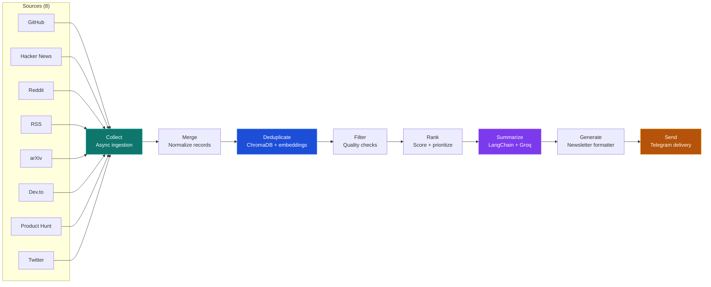

# 🧠 AI News Research Agent

> Autonomous AI news collection, ranking, summarization, and Telegram delivery powered by LangGraph.

**Status**: ✅ Production-ready | 📦 Free tier compatible | 🚀 Deploy to Render in 5 minutes

---

## 🎯 What It Does

- **Collects** AI news from 8 sources (RSS, GitHub, Hacker News, Reddit, arXiv, Dev.to, Product Hunt, Twitter)
- **Deduplicates** using semantic similarity (ChromaDB + HuggingFace embeddings)
- **Ranks** by importance using custom scoring
- **Summarizes** using Groq LLM (free)
- **Generates** a professional newsletter
- **Sends** to Telegram daily (24-hour cycle)

**All free**: Groq, Telegram, HuggingFace, Render 🎉

---

## 📊 Architecture



**Tech Stack**:
- **Orchestration**: LangGraph (DAG workflow engine)
- **Embeddings**: HuggingFace (free, local)
- **Vector DB**: ChromaDB (in-memory or persistent)
- **LLM**: Groq Llama-3.3 (free tier)
- **Messaging**: Telegram Bot API
- **Scheduler**: APScheduler (24-hour cycles)
- **Deployment**: Docker + Render (free)

---

## 🚀 Quick Start

### Local Development (5 minutes)

**Windows PowerShell**:
```powershell
# Create environment
python -m venv .venv
.venv\Scripts\Activate.ps1

# Install dependencies
pip install -r requirements.txt

# Configure
Copy-Item .env.example .env
# Edit .env with your API keys (see below)

# Run once
python main.py --mode workflow

# Or run on 24-hour schedule
python main.py --mode scheduler
```

**macOS/Linux**:
```bash
python -m venv .venv
source .venv/bin/activate
pip install -r requirements.txt
cp .env.example .env
# Edit .env
python main.py --mode workflow
```

### Get API Keys (All Free)

| Service | Key | How to Get | Notes |
|---------|-----|-----------|-------|
| **Groq** | `GROQ_API_KEY` | https://console.groq.com | Free tier: 30 reqs/min |
| **Telegram Bot** | `TELEGRAM_BOT_TOKEN` | @BotFather on Telegram | Create new bot |
| **Telegram Chat** | `TELEGRAM_CHAT_ID` | @userinfobot on Telegram | Get your user ID |
| **LangSmith** (optional) | `LANGCHAIN_API_KEY` | https://smith.langchain.com | For tracing |

### Configure .env

```env
# Required
GROQ_API_KEY=gsk_xxxxx
TELEGRAM_BOT_TOKEN=123456:ABC-DEF1234ghIkl-zyx57W2v1u123ew11
TELEGRAM_CHAT_ID=123456789

# Optional
LANGCHAIN_API_KEY=ls_xxxxx
POSTGRES_URL=  # Leave empty for free tier
USE_POSTGRES_CHECKPOINT=false
```

---

## 🌐 Deploy to Render (Free Tier)

**1-click deploy** with zero cost:

1. Push to GitHub (already done)
2. Sign up to https://render.com
3. Create Web Service + Cron Job (5 minutes)
4. Set environment variables
5. Done! Telegram messages arrive daily

**[📖 Full Render Deployment Guide](RENDER_DEPLOYMENT.md)**

**Free tier includes**:
- 750 compute hours/month (≈ daily runs)
- Auto-deploys from GitHub
- No database (we use in-memory)
- Cron jobs for scheduling

---

## 📝 Modes

```bash
# One-shot newsletter (for Render)
python main.py --mode workflow

# 24-hour scheduler (for local/server)
python main.py --mode scheduler

# Telegram command bot (polling mode)
python main.py --mode bot

# Docker
docker-compose up -d
```

---

## 🧪 Testing

```bash
# Run smoke tests
pytest tests/

# Run single test
pytest tests/test_smoke.py::test_newsletter_generation_smoke

# Validate production setup
python validate_production.py
```

---

## 📚 Documentation

| File | Purpose |
|------|---------|
| [ARCHITECTURE.md](ARCHITECTURE.md) | System design & component relationships |
| [AGENTS.md](AGENTS.md) | Agent definitions, responsibilities, workflow |
| [CLAUDE.md](CLAUDE.md) | Development commands & codebase reference |
| [RENDER_DEPLOYMENT.md](RENDER_DEPLOYMENT.md) | Step-by-step Render deployment |

---

## 💡 Key Features

✅ **Async News Collection** — 8 sources in parallel (< 5 sec)  
✅ **Semantic Deduplication** — No duplicate news via embeddings  
✅ **Smart Ranking** — Score by virality + importance  
✅ **LLM Summarization** — Concise, readable summaries  
✅ **Free Embeddings** — HuggingFace local (no API cost)  
✅ **Telegram Integration** — Chunked messages, command handlers  
✅ **Production Scheduler** — 24-hour cycles with retry logic  
✅ **LangGraph Workflow** — DAG-based orchestration  
✅ **Docker Ready** — Containerized for cloud  
✅ **Monitoring** — LangSmith tracing support  

---

## 🎯 Roadmap

- [x] MVP: News collection + summarization
- [x] Production: Deduplication + ranking + Telegram
- [x] Free tier: Render deployment + free embeddings
- [ ] Multi-agent supervisor architecture
- [ ] Personalization (user preferences)
- [ ] Web dashboard
- [ ] Multi-language support

---

## 🤝 Contributing

Contributions welcome! See [AGENTS.md](AGENTS.md) for architecture guidelines.

---

## 📄 License

MIT

---

## 🆘 Support

- **Stuck on setup?** → See [RENDER_DEPLOYMENT.md](RENDER_DEPLOYMENT.md)
- **Want to understand architecture?** → Read [ARCHITECTURE.md](ARCHITECTURE.md)
- **Need to debug?** → Check logs: `python validate_production.py`

---

**Your 24/7 AI news agent is ready! 🚀**
