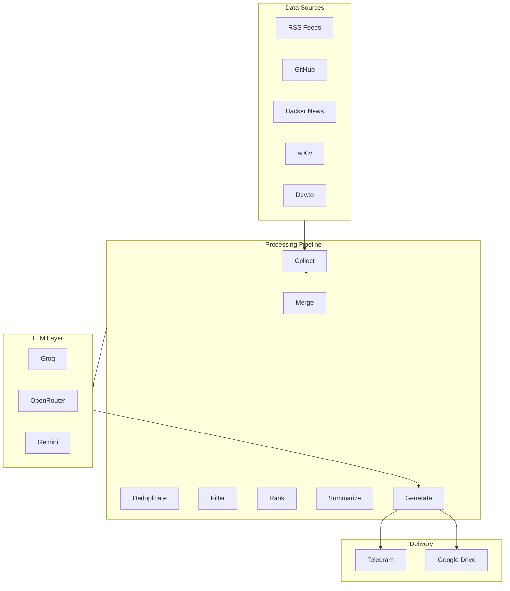

# AI Intelligence Newsletter Agent

<p align="center">

[](https://www.python.org/)
[](LICENSE)
[](https://langchain-ai.github.io/langgraph/)
[](https://render.com)
[](https://github.com/himanshu231204/ai-news-agent)

</p>

> An autonomous AI-powered research and newsletter generation system that collects AI news from multiple sources, filters high-signal information, ranks developments by importance, and delivers professional newsletters via Telegram — all orchestrated through LangGraph.

---

## Why This Project?

| Problem | Solution |
|---------|----------|
| Information overload in AI | Multi-source collection with smart filtering |
| Manual news curation | Automated daily newsletter generation |
| Expensive AI services | Free-tier compatible (Groq, HuggingFace, Render) |
| Generic news summaries | LLM-powered contextual summaries |
| No personalization | Keyword-based content filtering |

---

## Key Features

- **Multi-Source Collection** — RSS feeds, GitHub Trending, Hacker News, Reddit, arXiv, Dev.to
- **Semantic Deduplication** — ChromaDB + HuggingFace embeddings for duplicate detection
- **Smart Ranking** — Weighted scoring by virality, technical importance, and community attention
- **LLM Summarization** — Groq (primary) → OpenRouter (fallback) → Gemini (formatting)
- **Telegram Delivery** — Daily newsletters with command handlers (`/daily`, `/trending`, etc.)
- **LangGraph Orchestration** — DAG-based workflow with parallel execution and checkpointing
- **Production-Ready** — Docker, error handling, retry logic, LangSmith tracing

---

## Architecture



### Tech Stack

| Component | Technology |
|-----------|-------------|
| Orchestration | LangGraph 0.2+ |
| LLM Primary | Groq Llama-3.3 |
| LLM Fallback | OpenRouter DeepSeek |
| Embeddings | HuggingFace Sentence Transformers |
| Vector Store | ChromaDB |
| Database | PostgreSQL |
| API Server | FastAPI |
| Messaging | Telegram Bot API |
| Scheduler | APScheduler |
| Observability | LangSmith |
| Deployment | Docker + Render |

---

## Quick Start

### Prerequisites

- Python 3.11+
- Telegram account
- Groq API key (free)

### Installation

```bash
# Clone the repository
git clone https://github.com/himanshu231204/ai-news-agent.git
cd ai-news-agent

# Create virtual environment
python -m venv .venv

# Activate (Windows)
.venv\Scripts\Activate.ps1

# Activate (macOS/Linux)
source .venv/bin/activate

# Install dependencies
pip install -r requirements.txt
```

### Configuration

```bash
# Copy environment template
cp .env.example .env

# Edit with your API keys
# Required: GROQ_API_KEY, TELEGRAM_BOT_TOKEN, TELEGRAM_CHAT_ID
```

### Run Modes

```bash
# One-shot newsletter generation
python main.py --mode workflow

# 24-hour scheduler (local/server)
python main.py --mode scheduler

# Telegram bot polling
python main.py --mode bot
```

---

## Environment Variables

| Variable | Description | Required |
|----------|-------------|----------|
| `GROQ_API_KEY` | Groq API key from console.groq.com | Yes |
| `TELEGRAM_BOT_TOKEN` | Bot token from @BotFather | Yes |
| `TELEGRAM_CHAT_ID` | Chat ID from @userinfobot | Yes |
| `OPENROUTER_API_KEY` | OpenRouter API key (fallback) | No |
| `GOOGLE_SERVICE_ACCOUNT` | Google service account JSON | No |
| `LANGCHAIN_API_KEY` | LangSmith API key (tracing) | No |
| `POSTGRES_URL` | PostgreSQL connection string | No |

---

## Telegram Commands

| Command | Description |
|---------|-------------|
| `/start` | Welcome message & commands |
| `/daily` | Send today's newsletter |
| `/trending` | Top 5 trending AI news |
| `/opensource` | Open source AI projects |
| `/research` | Latest AI research papers |
| `/sources` | List configured news sources |
| `/developerinfo` | Developer info & links |
| `/help` | Show all commands |

---

## Deployment

### Docker

```bash
# Build and run
docker-compose up -d

# View logs
docker-compose logs -f
```

### Render (Free Tier)

1. Push to GitHub
2. Create [Render](https://render.com) account
3. Connect repository
4. Set environment variables
5. Deploy

See [DEPLOYMENT.md](docs/DEPLOYMENT.md) for detailed instructions.

---

## Project Structure

```
ai-news-agent/
├── app/
│   ├── collectors/          # News source collectors
│   │   ├── rss.py          # RSS feed parser
│   │   ├── github.py       # GitHub Trending
│   │   ├── hackernews.py   # Hacker News API
│   │   └── reddit.py       # Reddit API
│   │
│   ├── graph/              # LangGraph workflow
│   │   ├── workflow.py    # Main workflow definition
│   │   ├── state.py       # Typed state schema
│   │   ├── builder.py     # Graph builder
│   │   └── nodes/         # Individual nodes
│   │
│   ├── ranking/            # News ranking & deduplication
│   │   ├── scorer.py      # Scoring logic
│   │   └── deduplication.py
│   │
│   ├── summarization/      # LLM summarization
│   │   ├── summarizer.py  # Summarization logic
│   │   └── prompts.py    # LLM prompts
│   │
│   ├── newsletter/         # Newsletter generation
│   │   ├── generator.py   # Newsletter builder
│   │   └── linkedin_generator.py
│   │
│   ├── telegram/           # Telegram integration
│   │   ├── bot.py         # Bot setup
│   │   └── handlers.py    # Command handlers
│   │
│   ├── database/           # Data persistence
│   ├── memory/            # Memory & checkpointing
│   ├── observability/     # LangSmith tracing
│   ├── scheduler/         # APScheduler jobs
│   └── config/            # Pydantic settings
│
├── tests/                  # Test suite
├── docker/                 # Docker files
├── docs/                  # Documentation
├── main.py               # Entry point
├── requirements.txt      # Dependencies
└── .env.example         # Environment template
```

---

## Testing

```bash
# Run all tests
pytest tests/ -v

# Run with coverage
pytest tests/ --cov=app --cov-report=html

# Run specific test
pytest tests/test_workflow.py -v
```

---

## Documentation

| Document | Description |
|----------|-------------|
| [Architecture](docs/ARCHITECTURE.md) | System design & diagrams |
| [Deployment](docs/DEPLOYMENT.md) | Deployment guides |
| [API Reference](docs/API_REFERENCE.md) | API documentation |
| [Troubleshooting](docs/TROUBLESHOOTING.md) | Common issues & solutions |

---

## Roadmap

| Phase | Status | Features |
|-------|--------|----------|
| Phase 1 | ✅ Complete | RSS, basic summarization, Telegram delivery |
| Phase 2 | ✅ Complete | Reddit, GitHub trending, ranking, deduplication |
| Phase 3 | 🔄 In Progress | Twitter integration, personalization |
| Phase 4 | 📋 Planned | Multi-agent architecture, SaaS dashboard |

---

## Contributing

Contributions are welcome! Please read [CONTRIBUTING.md](CONTRIBUTING.md) for details.

```bash
# Fork the repo
# Create a feature branch
# Make your changes
# Run tests
# Submit a PR
```

---

## License

This project is licensed under the MIT License - see [LICENSE](LICENSE) for details.

---

## Support

- **Documentation**: Check the [docs/](docs/) folder
- **Issues**: Open a [GitHub Issue](https://github.com/himanshu231204/ai-news-agent/issues)

---

<p align="center">

**Built with ❤️ using LangGraph, LangChain, and FastAPI**

*Your 24/7 AI news agent is ready! 🚀*

</p>