# AI Intelligence Newsletter Agent - System Architecture

> Production-grade architecture documentation for the AI News Research Agent system.

---

## 1. High-Level Architecture Diagram

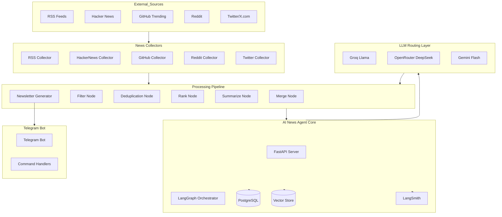

---

## 2. Detailed Workflow Diagram

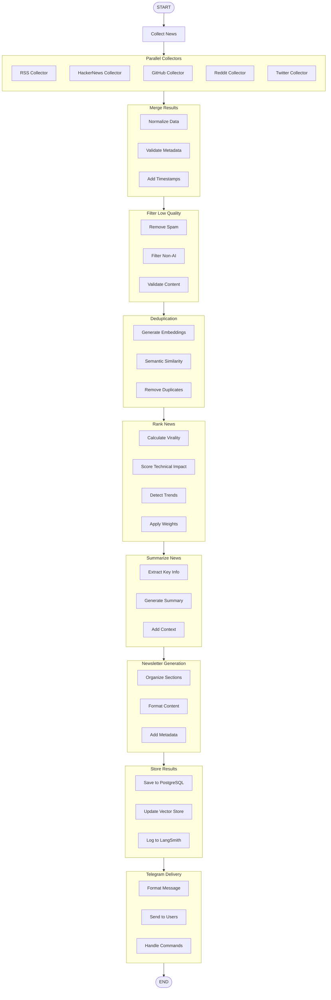

---

## 3. LangGraph Workflow Diagram

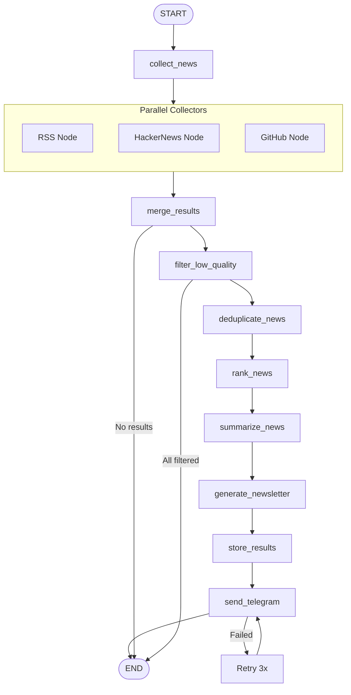

---

## 4. LLM Provider Routing Diagram

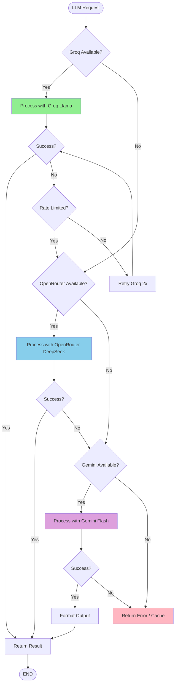

---

## 5. Data Flow Diagram

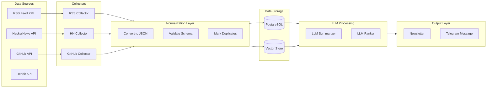

---

## 6. Collector Pipeline Diagram

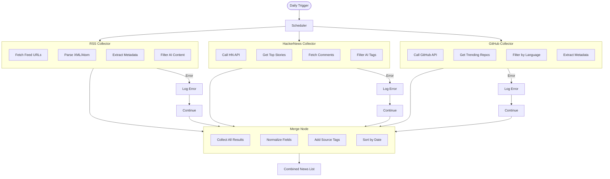

---

## 7. Newsletter Generation Pipeline

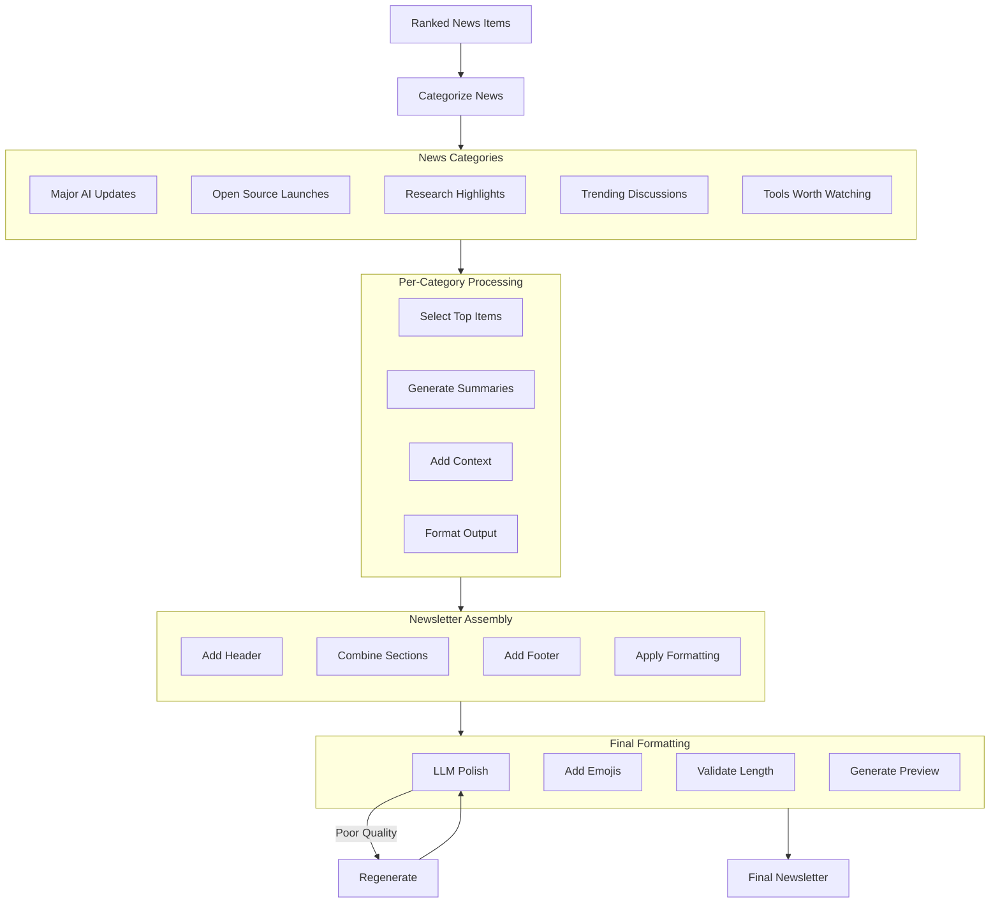

---

## 8. Telegram Delivery Workflow

```mermaid
flowchart TD
    START([Newsletter Ready]) --> FORMAT[Format for Telegram]
    
    subgraph Format["Message Formatting"]
        direction TB
        F1[Split Long Messages]
        F2[Add Markdown]
        F3[Add Preview]
        F4[Add Navigation]
    end
    
    FORMAT --> Format
    
    subgraph Send["Send Process"]
        direction TB
        S1[Get Subscriber List]
        S2[Batch Messages]
        S3[Send to Each User]
        S4[Track Delivery]
    end
    
    Format --> Send
    
    subgraph Commands["Command Handlers"]
        direction TB
        C1[/daily - Send Daily]
        C2[/trending - Send Trending]
        C3[/opensource - OS Projects]
        C4[/research - Research Papers]
        C5[/subscribe - Subscribe]
        C6[/unsubscribe - Unsubscribe]
    end
    
    Send --> Commands
    
    subgraph User_Interaction["User Interactions"]
        direction TB
        U1[User Sends Command]
        U2[Parse Command]
        U3[Execute Handler]
        U4[Send Response]
    end
    
    Commands --> User_Interaction
    
    User_Interaction --> END([END])
    
    %% Error Handling
    Send -->|Failed| RETRY[Retry 3x]
    RETRY -->|Success| Track_Delivery[Track Delivery]
    RETRY -->|Failed| LOG_ERROR[Log Error]
    LOG_ERROR --> ALERT[Alert Admin]
```

---

## 9. Error Handling + Fallback Workflow

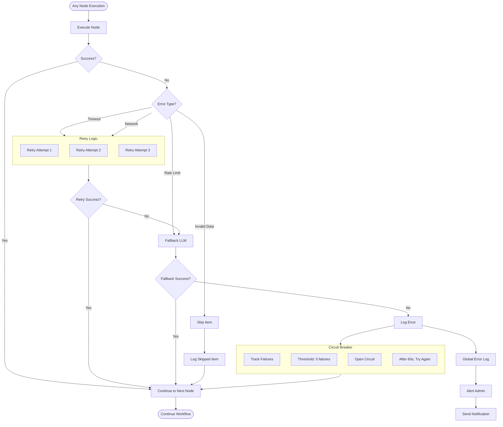

---

## 10. Deployment Architecture

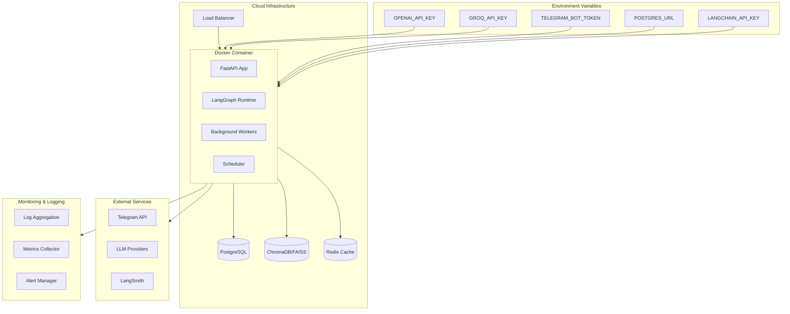

---

## 11. State Graph Schema

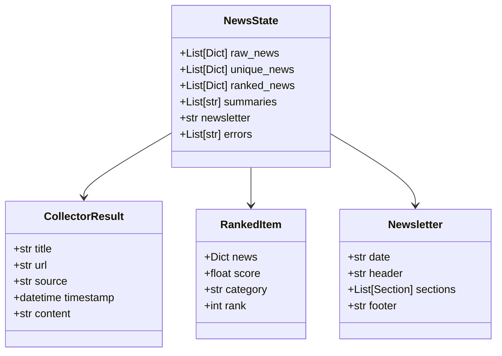

---

## 12. Component Interaction Diagram

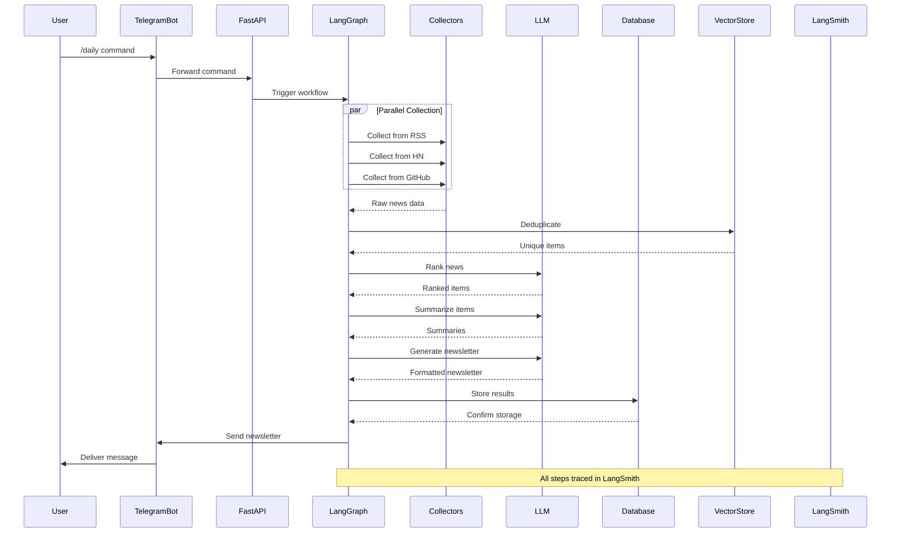

---

## 13. Async Execution Flow

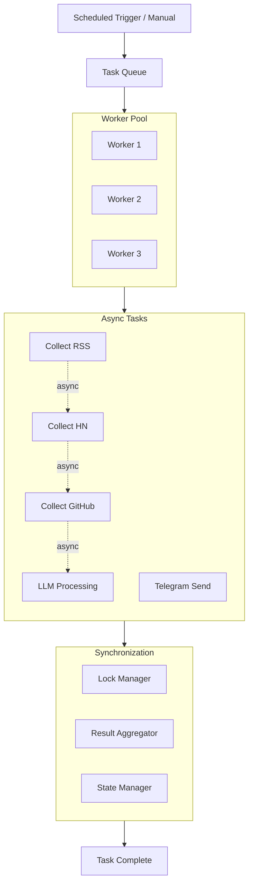

---

## 14. System Component Summary

| Component | Technology | Purpose |
|-----------|------------|---------|
| Orchestration | LangGraph | Workflow management |
| API Server | FastAPI | REST endpoints |
| Database | PostgreSQL | Persistent storage |
| Vector Store | ChromaDB/FAISS | Semantic search |
| Observability | LangSmith | Tracing & monitoring |
| Messaging | Telegram Bot | User delivery |
| LLM Primary | Groq Llama | Fast processing |
| LLM Fallback | OpenRouter DeepSeek | Rate limit handling |
| LLM Formatting | Gemini Flash | Final polish |

---

## 15. Environment Configuration

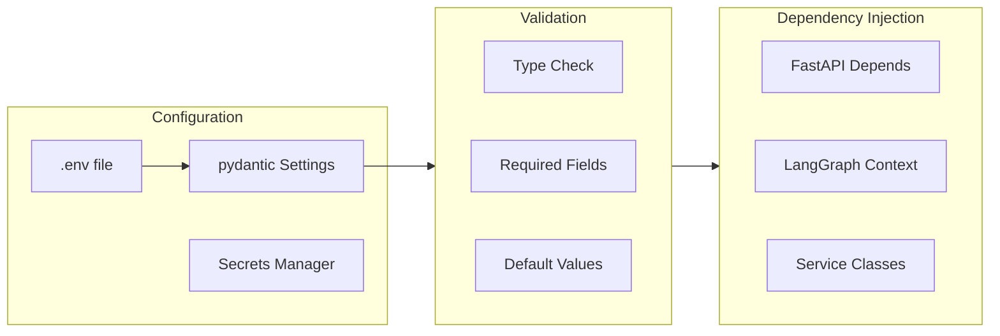

---

*Document Version: 1.0*
*Generated for: AI Intelligence Newsletter Agent*
*Architecture: Production-Ready Multi-Agent System*