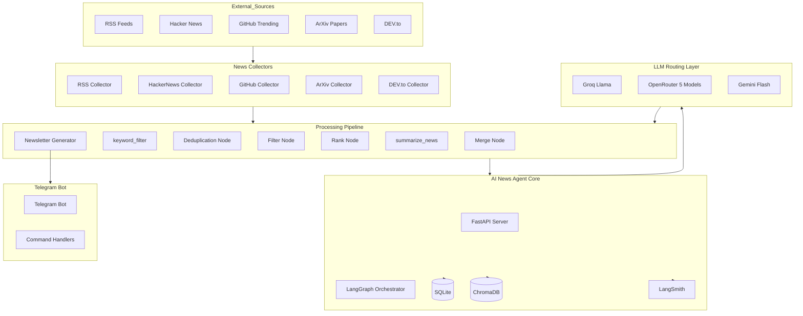
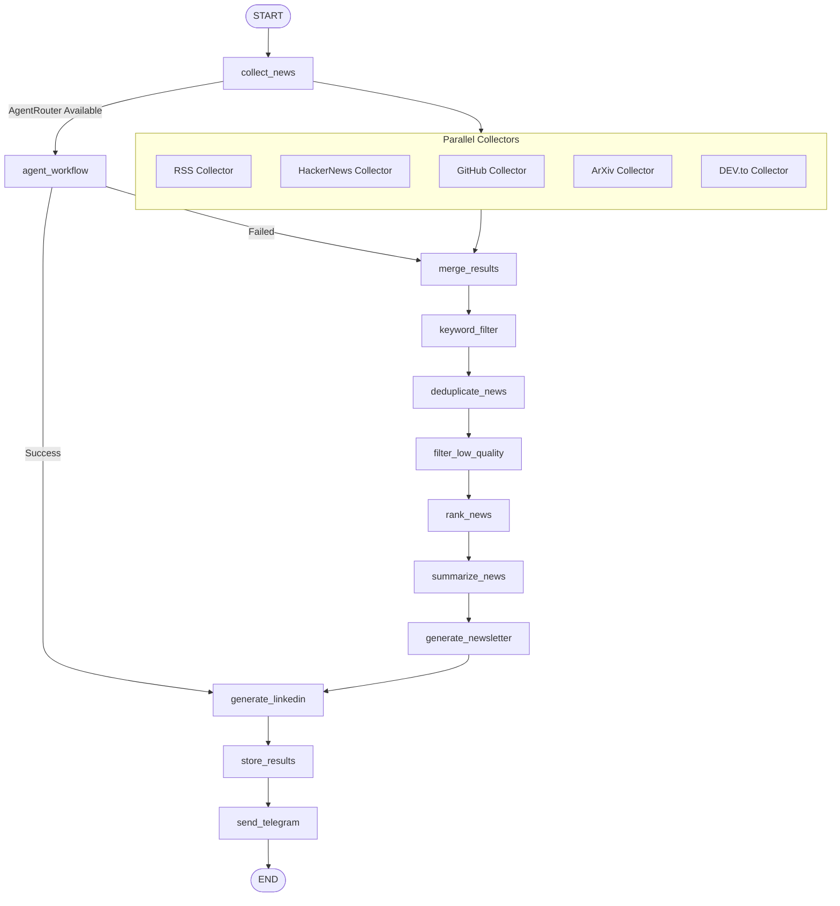
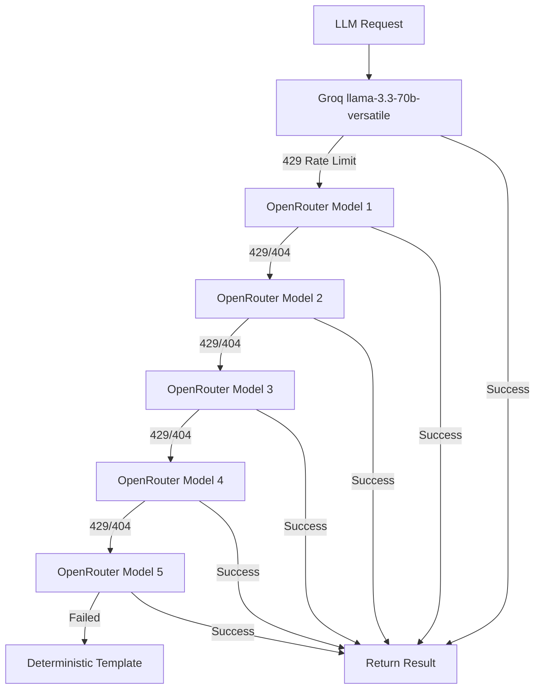
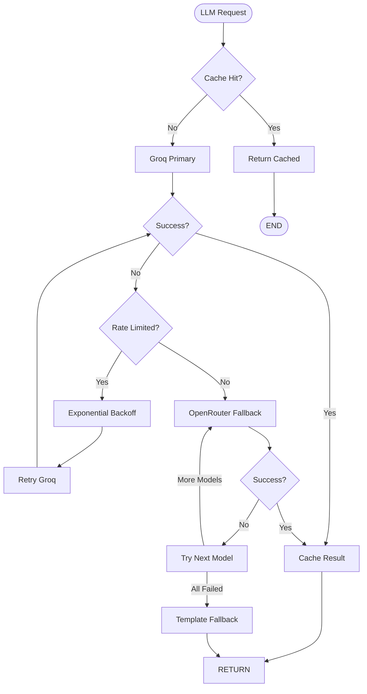
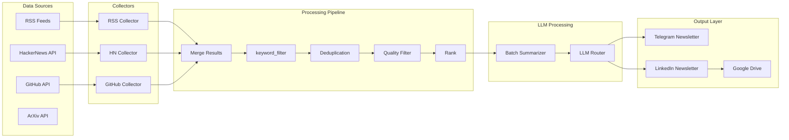
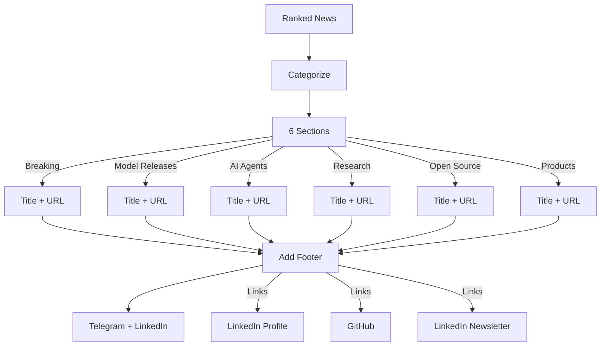
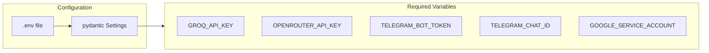
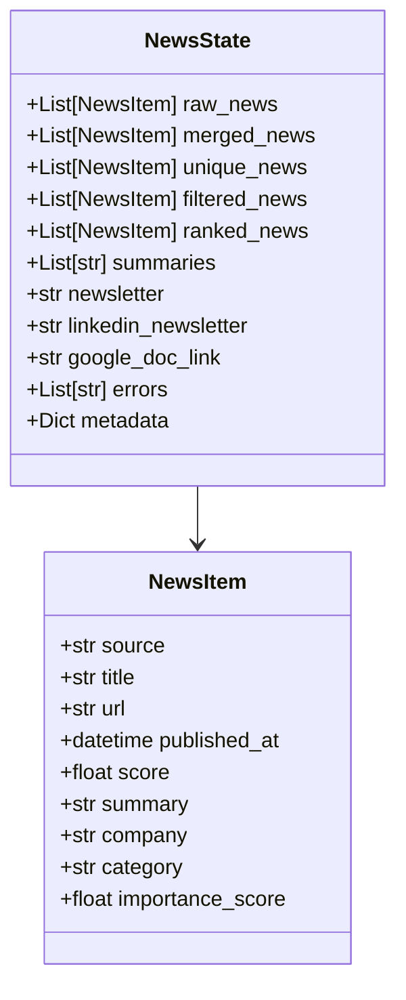

# AI Intelligence Newsletter Agent - System Architecture

> Production-grade architecture documentation for the AI News Research Agent system.
> Updated with optimizations for API rate limits and token efficiency.

---

## 1. High-Level Architecture Diagram



---

## 2. Optimized Workflow Diagram



---

## 3. Key Optimizations

### 3.1 Local Keyword Filtering
- **Before LLM calls** - Filters 46% of non-AI articles
- Uses high-signal keywords: OpenAI, Anthropic, Claude, GPT-5, Gemini, LangGraph, etc.
- No LLM needed - pure Python filtering

### 3.2 Batch Summarization
- **10 articles per LLM call** instead of 1-by-1
- 90% fewer API calls
- Uses asyncio semaphore (max 2 concurrent)

### 3.3 Token Optimization
- Only sends: title + short summary (200 chars) + source
- Does NOT send full article content

### 3.4 Provider Fallback Chain


### 3.5 Caching
- SQLite-based summary cache (7-day TTL)
- Reduces redundant API calls

### 3.6 Rate Limiting
- Exponential backoff: 2s → 4s → 8s (capped)
- Max 3 retries per provider

---

## 4. LLM Provider Routing



---

## 5. Data Flow



---

## 6. Newsletter Format



---

## 7. Telegram Delivery

```mermaid
flowchart TD
    START([Newsletter Ready]) --> FORMAT[Format Markdown]
    
    FORMAT --> SPLIT[Split if >3800 chars]
    
    SPLIT --> SEND[Send via Telegram API]
    
    SEND --> SUCCESS{Success?}
    SUCCESS -->|Yes| TRACK[Track Delivery]
    SUCCESS -->|No| RETRY[Retry 3x]
    
    RETRY --> RETRY_SUCCESS{Retry Success?}
    RETRY_SUCCESS -->|Yes| TRACK
    RETRY_SUCCESS -->|No| LOG[Log Error]
    
    TRACK --> END([END])
    
    subgraph Commands["Command Handlers"]
        C1[/daily]
        C2[/trending]
        C3[/subscribe]
        C4[/unsubscribe]
    end
    
    SEND --> Commands
```

---

## 8. Component Summary

| Component | Technology | Purpose |
|-----------|------------|---------|
| Orchestration | LangGraph | Workflow management |
| API Server | FastAPI | REST endpoints |
| Database | SQLite | Persistent storage |
| Vector Store | ChromaDB | Semantic search/dedup |
| Observability | LangSmith | Tracing & monitoring |
| Messaging | Telegram Bot | User delivery |
| LLM Primary | Groq Llama | Fast processing |
| LLM Fallback | OpenRouter (5 models) | Rate limit handling |
| LLM Formatting | Gemini Flash | Final polish |
| Caching | SQLite | Summary cache (7-day TTL) |

---

## 9. Environment Variables



---

## 10. State Schema



---

*Document Version: 2.0*
*Updated: May 2026*
*Key Changes: Added keyword filtering, batch summarization, provider fallbacks, caching*