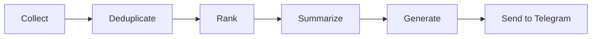

# ❓ Frequently Asked Questions

---

## General

### What is the AI News Agent?

The AI News Agent is an autonomous system that collects AI news from multiple sources, filters high-signal information, ranks developments by importance, generates professional newsletters, and delivers them via Telegram — all powered by LangGraph.

### Is this free to use?

Yes! The core functionality is free. You only need:
- **Groq API** - Free tier (30 requests/minute)
- **Telegram** - Free messaging platform

Optional paid services:
- **LangSmith** - For advanced tracing (free tier available)
- **PostgreSQL** - For production (optional)

### What sources does it collect from?

Currently supported:
- RSS feeds (AI newsletters, blogs)
- GitHub Trending
- Hacker News
- Reddit (r/Artificial, r/MachineLearning)
- arXiv (AI papers)
- Dev.to
- Product Hunt
- Twitter/X (future)

---

## Technical

### What programming language/framework is used?

- **Python 3.11+** - Primary language
- **LangGraph** - Workflow orchestration
- **FastAPI** - API server
- **ChromaDB** - Vector database
- **PostgreSQL** - Persistent storage

### How does the workflow work?



### Can I run this locally?

Yes! See [INSTALLATION.md](INSTALLATION.md) for local setup.

### How do I deploy to production?

See [DEPLOYMENT.md](DEPLOYMENT.md) for deployment options (Render, Railway, Docker, Kubernetes).

---

## Configuration

### How do I get a Groq API key?

1. Go to [console.groq.com](https://console.groq.com)
2. Sign up/Login
3. Click "Create API Key"
4. Copy to `.env` as `GROQ_API_KEY=your_key`

### How do I create a Telegram bot?

1. Open Telegram
2. Search for @BotFather
3. Send `/newbot`
4. Follow prompts
5. Copy the token to `.env`

### How do I find my Telegram Chat ID?

1. Search for @userinfobot on Telegram
2. Send any message
3. Copy the numeric ID to `.env`

---

## Customization

### How do I add more RSS feeds?

Edit the RSS feeds list in the collector:

```python
# app/collectors/rss.py
RSS_FEEDS = [
    "https://example.com/feed1.xml",
    "https://example.com/feed2.xml",
    # Add more here
]
```

### How do I change the newsletter schedule?

In `.env`:
```env
NEWSLETTER_HOUR=9    # Hour (0-23)
NEWSLETTER_MINUTE=0  # Minute (0-59)
```

### How do I customize the newsletter format?

Edit the formatter in `app/newsletter/formatter.py`.

---

## Troubleshooting

### Why is my newsletter empty?

Possible causes:
1. **No news collected** - Check API keys
2. **All filtered out** - Lower similarity threshold
3. **Rate limited** - Wait and retry

### Why am I getting rate limit errors?

Groq free tier has limits. Add fallback:

```env
OPENROUTER_API_KEY=your_openrouter_key
```

### Why isn't Telegram receiving messages?

Check:
1. Bot token is correct
2. Chat ID is correct
3. Bot was started with `/start`

---

## Contributing

### How can I contribute?

See [CONTRIBUTING.md](../CONTRIBUTING.md) for:
- Bug reports
- Feature suggestions
- Pull requests

### What languages/tools do I need?

- Python 3.11+
- Git
- Basic understanding of LangGraph

### Are there tests?

Yes! Run tests:

```bash
pytest tests/ -v
```

---

## Security

### Is my data secure?

- API keys stored in environment variables
- No secrets in code
- Input validation on all endpoints
- Optional: Use PostgreSQL with SSL

### Can I run this on my own server?

Yes! Use Docker:

```bash
docker-compose up -d
```

---

## Future

### What's coming next?

See [ROADMAP.md](../ROADMAP.md) for:
- Twitter integration
- User personalization
- Multi-agent architecture
- Web dashboard

### How can I suggest features?

Open a [GitHub Discussion](https://github.com/yourusername/ai-news-agent/discussions) or create an issue.

---

## Other Questions

### How do I contact the maintainers?

- **GitHub Issues** - For bugs
- **GitHub Discussions** - For questions
- **Email** - See GitHub profile

### Is there a community?

Join our [Discord server](link) (if available) or participate in GitHub Discussions.

---

*Still have questions? Open an issue on GitHub!*